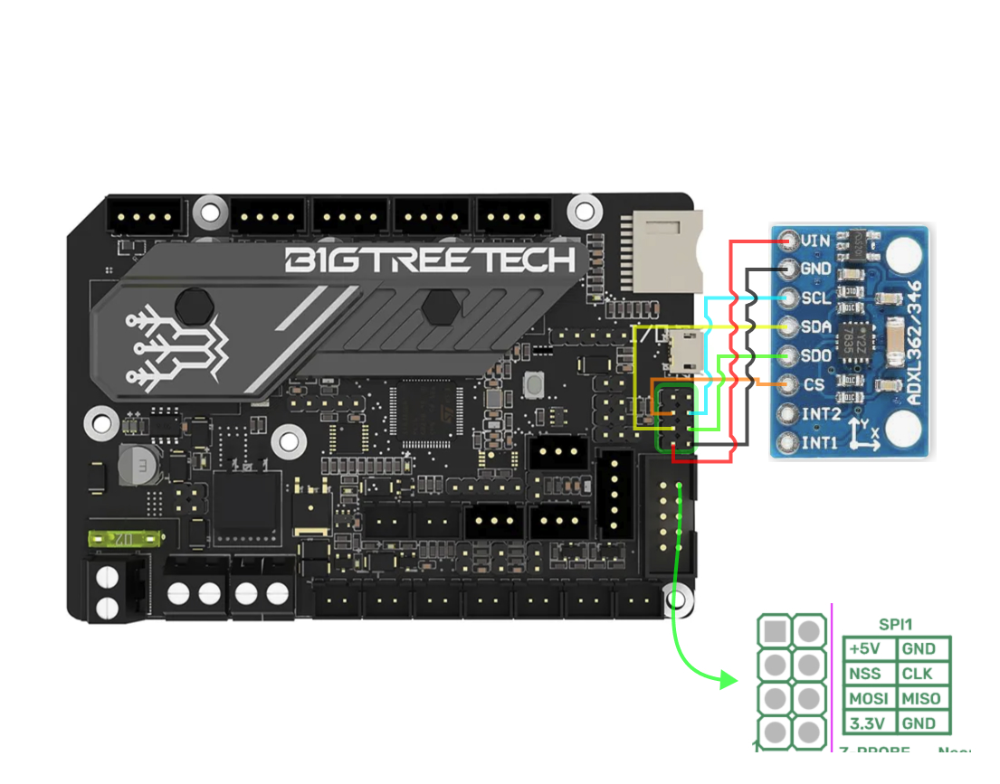
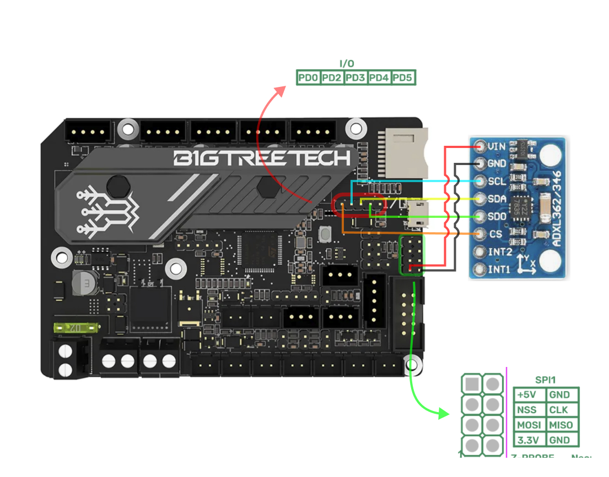
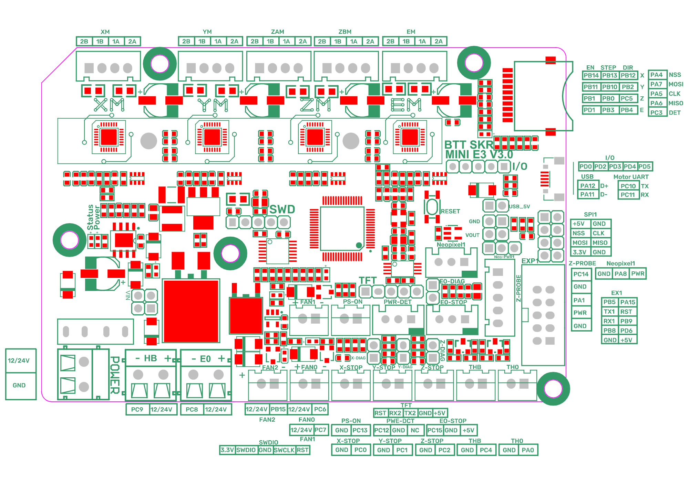
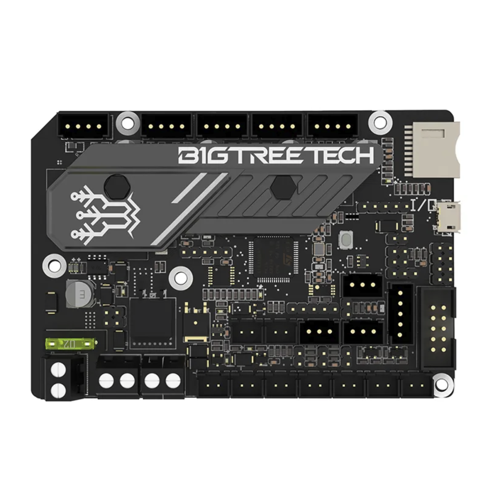
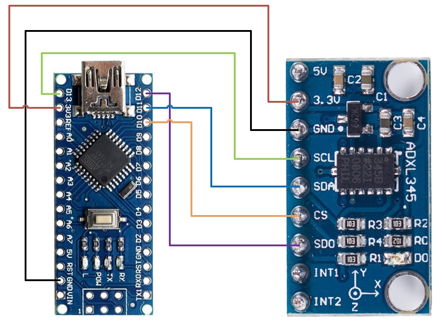

# Klipper - ADXL345 SKR MINI E3 v3.0

Different methods to connect ADXL345 to SKR MINI 3E v3

in your configuration file we add at the beginning of your configuration file
comment out the `[input_shaper]` so there are no problems.

```
[include adxl345.cfg]
```

Depending on how you are going to connect it you have to comment or uncomment pertinent parts

# SPI 1

| pin row | pin row |
| --------| ------- |
| 1 -  x | 2 - x|
| 3 - NSS | 4 - CLK |
| 5 - MOSI | 6 - MISO |
| 7 - 3.3v vcc | 8 - GND |



```
[adxl345]
cs_pin: PD9
spi_bus: spi1
```

---

# I/O PORT

|PD0 | PD2 | PD3 | PD4 | PD5 |
|-----|-----|-----|-----|-----|
| cs  | scl | sda | sd0 |  x |
| NSS | CLK | MOSI| MISO|  x |



```
[adxl345]
cs_pin: PD0
spi_software_miso_pin: PD4
spi_software_sclk_pin: PD2
spi_software_mosi_pin: PD3
```

---

## Pinout



## G-Code Commands

1) command `MEASURE_AXES_NOISE` Should be somewhere in the range of ~1-100
2) `TEST_RESONANCES AXIS=X`
3) `TEST_RESONANCES AXIS=Y`
4) ~/klipper/scripts/calibrate_shaper.py /tmp/resonances_x_*.csv -o /tmp/shaper_calibrate_x.png
    ~/klipper/scripts/calibrate_shaper.py /tmp/resonances_y_*.csv -o /tmp/shaper_calibrate_y.png

---

# ARDUINO as second MCU



|pin sensor|pin arduino|arduino nano|
|---|---|---|
|CS|10/PB2|D10|
|SD0|12/PB4|D12|
|SDA|11/PB3|D11|
|SCL|13/PB5|D13|
|GND|GND|GND|
|VCC|3.3V|3.3v|

# Flashing

***old version of avrdude***:

    1) `sudo nano /etc/apt/sources.list`
    2) Add `deb http://raspbian.raspberrypi.org/raspbian/ buster main contrib non-free rpi`
    3) Save and quit (`:wq`)
    4) `sudo nano /etc/apt/preferences.d/avr-buster`
    5) Type below and save file
        ```
        Package: avr-libc avrdud binutils-avr gcc-avr
        Pin: release n=buster
        Pin-Priority: 1001
        ```
    6) Save and quit (`:wq`)
    7) ```
        sudo apt update
        sudo apt install avr-libc avrdude binutils-avr gcc-avr
        cd ~/klipper
        make menuconfig
        ```
    8) Change Micro-controller Architecture to ***Atmega AVR*** and Processor model to atmega<168|328|328p>
    9) Press `q` and `y`
    10) ````
        make clean
        make
        avrdude -patmega328p -c arduino  -b 57600 -P /dev/ttyUSB1 -v  -D -Uflash:w:out/klipper.elf.hex:i
        ```
        ***Note***: `/dev/ttyUSB1` may be different on your system and per printer primary MCU. Change any reference to match further ahead.
    11) Once this is completed, nano will be ready to be used as a Second Klipper MCU


***new version:***
    ```
    sudo sed -i '$ a\deb http://raspbian.raspberrypi.org/raspbian/ buster main contrib non-free rpi' /etc/apt/sources.list

    echo -e "Package: avr-libc avrdude binutils-avr gcc-avr\nPin: release n=buster\nPin-Priority: 1001" | sudo tee /etc/apt/preferences.d/avr-buster > /dev/null

    sudo apt update

    sudo apt install avr-libc avrdude binutils-avr gcc-avr

    avrdude -patmega328p -c arduino  -b 57600 -P /dev/ttyUSB1 -v  -D -Uflash:w:out/klipper.elf.hex:i
    ```


---

# printer.cfg

Be sure to change serial address below as per output of 'ls /dev/serial/by-id/*'

```
[mcu arduino_nano_adxl]
serial: dev/serial/by-id/<usb-Arduino... | 1a86_USB2.0-Serial-if00-port0>

[adxl345]
cs_pin: arduino_nano_adxl:PB2
```

---

## Star History

[](https://star-history.com/#klich3/klipper---adxl345-skr-mini-e3-v3.0&Date)
